# Smartthings Remote control for Outlander PHEV
Smartthings application wrapper over phevctl
- [](https://github.com/vzakharchenko/smartthings-phevctl/actions/workflows/build.yml)
- [](https://github.com/vzakharchenko/smartthings-phevctl/actions/workflows/docker.yml)
- [](https://github.com/vzakharchenko/smartthings-phevctl/actions/workflows/docker_armv6.yml)
- [](https://npmjs.org/package/smartthings-phevctl)
- [](https://secure.wayforpay.com/button/b7a954a7c7177)

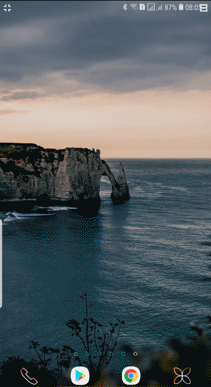

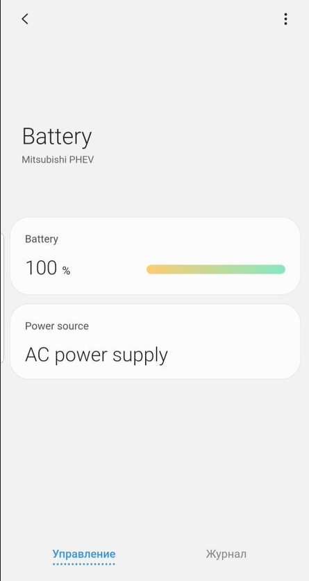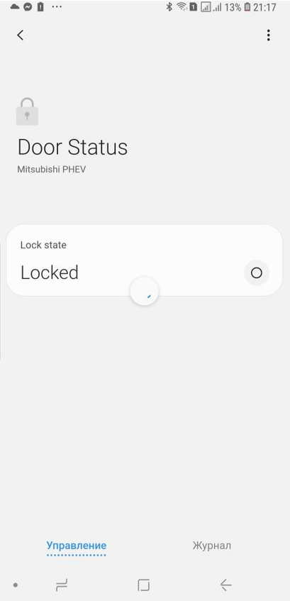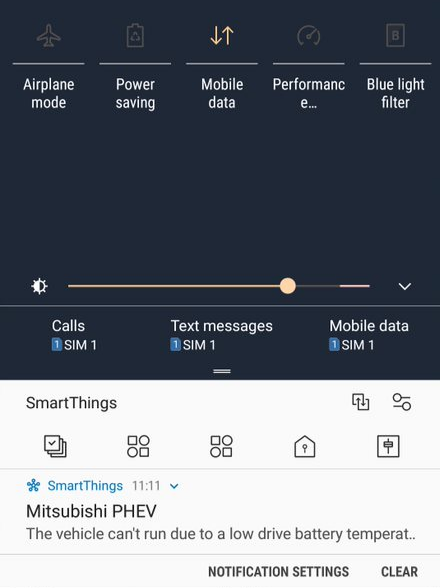

## Features:
- switch on/off condition/heater
- receive warning message from the remote EV and send it in push Notification.
- send Notification "Pre A/C has stopped. Possible causes of this are as follows: Door is Open. Main battery level is Low. Drive Battery temperature is Low."
- change mode of air conditioner: heater/cool/windscreen for 10/20/30 mins,
- show battery level
- support google home
- check if doors are closed
- Thermostat Operating State
- Support SMS if use mikrotik LTE
- possibility to control over voice(by Google assistant)

## Cloud Installation
- [cloud installation](https://github.com/vzakharchenko/remote-ctrl-gsm/blob/master/cloud/README.md)
- [hetzner cloud](https://github.com/vzakharchenko/remote-ctrl-gsm/wiki/gsm-extender-hetzner-cloud)
- [scaleway cloud](https://github.com/vzakharchenko/remote-ctrl-gsm/wiki/gsm-extender-scaleway-cloud)

## Installation Steps
1. [Install Server using Docker](https://github.com/vzakharchenko/smartthings-phevctl#server-docker-installation) or  [Manual Installation](https://github.com/vzakharchenko/smartthings-phevctl#server-manual-installation)
2. [create Device Handler](https://github.com/vzakharchenko/smartthings-phevctl#create-custom-dht)
3. [create smartapp](https://github.com/vzakharchenko/smartthings-phevctl#create-smartapp)
4. [Configure smartthings application on android or apple](https://github.com/vzakharchenko/smartthings-phevctl#configure-smartthings-application)
5. [Get "Smartthings Application Id" and "Smartthings Application Secret"](https://github.com/vzakharchenko/smartthings-phevctl#get-smartthings-application-id-and-smartthings-application-secret)
6. [Configure Server](https://github.com/vzakharchenko/smartthings-phevctl#configure-server)
7. [Add Smartthings devices](https://github.com/vzakharchenko/smartthings-phevctl#add-a-new-smartthings-device)

## Server Docker Installation
- Install docker
```
sudo su
curl -sSL https://get.docker.com | bash
usermod -aG docker $USER
```
- Supported Architectures: amd64,x86-64,arm64,ppc64le,arm/v7
```
docker -d run --name=smartthings-phevctl  -p 8080:8080 -p 8099:8099 -p 8098:8098 --restart=always vassio/smartthings-phevctl
```
or
```
echo "{}">/opt/remote-ctrl-gsm.json
docker -d run --name=smartthings-phevctl  -p 8080:8080 -p 8099:8099 -p 8098:8098 -v /opt/config/remote-ctrl-gsm.json:/opt/remote-ctrl-gsm.json --restart=always vassio/smartthings-phevctl
```

# Raspberry Pi Zero installation
1. Download [Raspberry Pi OS Lite](https://www.raspberrypi.org/software/operating-systems/#raspberry-pi-os-32-bit)
2. write the Raspberry Pi OS image to the SD card using [balenaEtcher](https://www.balena.io/etcher/) or analog
3. [write empty "ssh" and wpa_supplicant.conf files on sdcard (boot) ](https://desertbot.io/blog/headless-pi-zero-w-wifi-setup-windows)
4. install phevctl, node and smartthings-phevctl
```
sudo su
apt-get upgrade -y && apt-get -y install build-essential cmake git
mkdir /opt/phevctl
cd /opt/phevctl && git clone https://github.com/papawattu/msg-core
cd /opt/phevctl &&  git clone https://github.com/vzakharchenko/phevcore.git
cd /opt/phevctl && git clone https://github.com/DaveGamble/cJSON.git
cd /opt/phevctl && git clone https://github.com/vzakharchenko/phevctl
cd /opt/phevctl/cJSON && mkdir build && cd build && cmake .. && make && make install
cd /opt/phevctl/msg-core && mkdir build && cd build && cmake .. && make && make install
cd /opt/phevctl/phevcore && mkdir build && cd build && cmake .. && make && make install
cd /opt/phevctl/phevctl && mkdir -p build && cd build && cmake .. && make
rm -f /usr/bin/phevctl
ln -sf /opt/phevctl/phevctl/build/phevctl /usr/bin/phevctl
curl -o- https://raw.githubusercontent.com/nvm-sh/nvm/v0.37.2/install.sh | bash
nvm install node 10.10.0
npm i pm2 -g
env PATH=$PATH:/usr/bin pm2 startup systemd -u root --hp ${HOME}
pm2 startup -u root
npm i smartthings-phevctl -g
pm2 start `npm root -g`/smartthings-phevctl/smartthings-phevctl.js
pm2 save
```

## Server Manual Installation
```
sudo su
apt-get upgrade -y && apt-get -y install build-essential cmake git
mkdir /opt/phevctl
cd /opt/phevctl && git clone https://github.com/papawattu/msg-core
cd /opt/phevctl &&  git clone https://github.com/vzakharchenko/phevcore.git
cd /opt/phevctl && git clone https://github.com/DaveGamble/cJSON.git
cd /opt/phevctl && git clone https://github.com/vzakharchenko/phevctl
cd /opt/phevctl/cJSON && mkdir build && cd build && cmake .. && make && make install
cd /opt/phevctl/msg-core && mkdir build && cd build && cmake .. && make && make install
cd /opt/phevctl/phevcore && mkdir build && cd build && cmake .. && make && make install
cd /opt/phevctl/phevctl && mkdir -p build && cd build && cmake .. && make
rm -f /usr/bin/phevctl
wget -qO- https://getpm2.com/install.sh | bash
env PATH=$PATH:/usr/bin pm2 startup systemd -u ${currentUser} --hp ${HOME}
npm i smartthings-phevctl -g
pm2 start `npm root -g`/smartthings-phevctl/smartthings-phevctl.js
pm2 save
```


## Smartthings installation

### Create Custom DHT
1. open [https://graph.api.smartthings.com/](https://graph.api.smartthings.com/)
2. open your location/ or create a new one 
3. open "My Device Handler" and "create New Device Handler"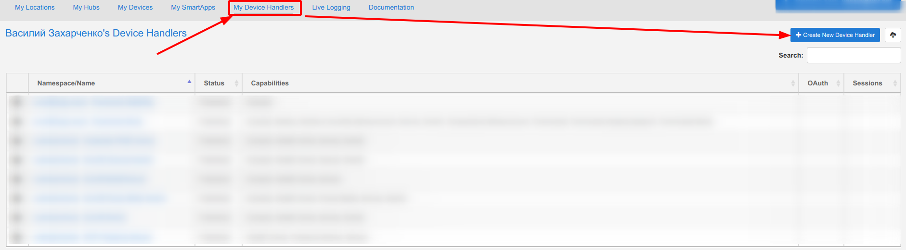
4. select from code and add [Outlander PHEV Action.groovy](./dht/Outlander PHEV Action.groovy), [Outlander PHEV Battery.groovy](./dht/Outlander PHEV Battery.groovy), [Outlander PHEV Thermostat.groovy](./dht/Outlander PHEV Thermostat.groovy) and [Outlander PHEV Doors.groovy](./dht/Outlander PHEV Doors.groovy) 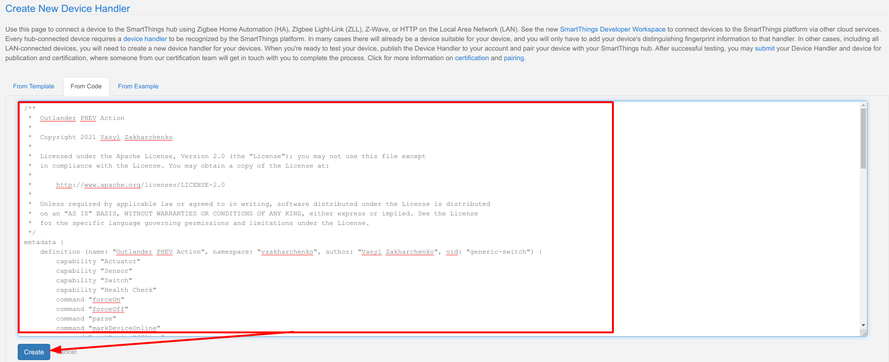
5. click save

### Create SmartApp
1. open [https://graph.api.smartthings.com/](https://graph.api.smartthings.com/)
2. open your location 
3. create a new SmartApp 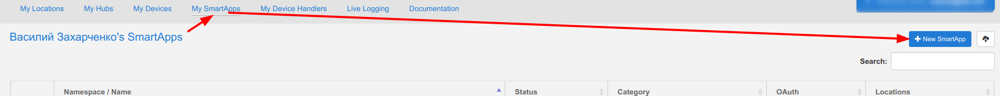
4. select from code and add [remote-ctrl-gsm.groovy](./smartapp/remote-ctrl-gsm.groovy)  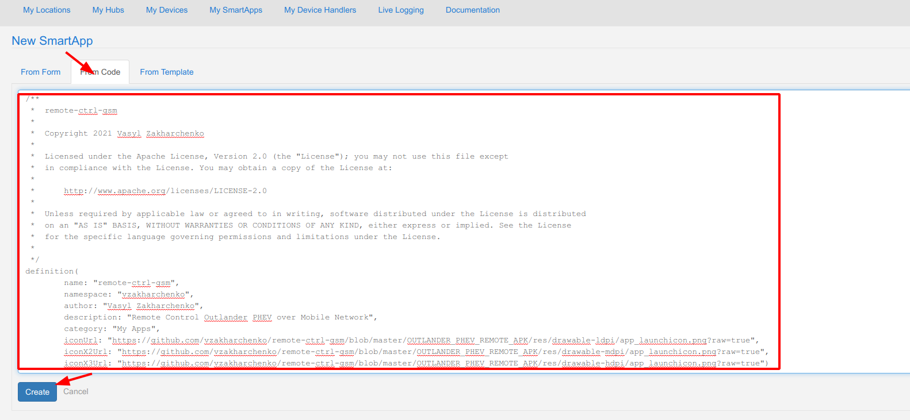
5. open smartapp application and click "App Settings"  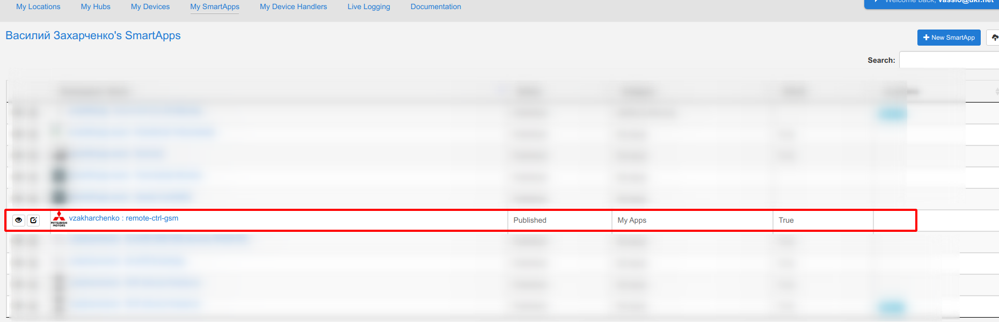 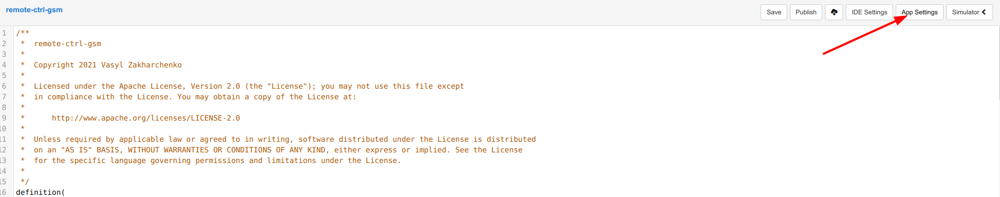
6. enable "OAuth" 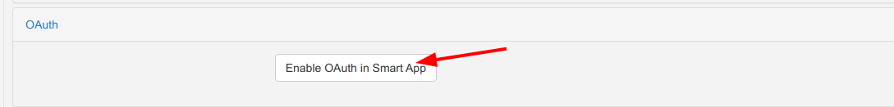
7. Save and publish application  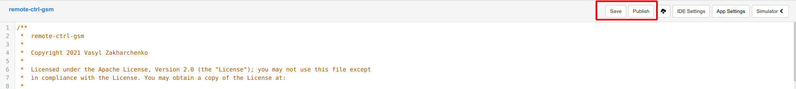

### Configure Smartthings application

1. open smartthings application in Phone [Android](https://play.google.com/store/apps/details?id=com.samsung.android.oneconnect) or [Apple](https://apps.apple.com/us/app/smartthings/id1222822904)
2. select location 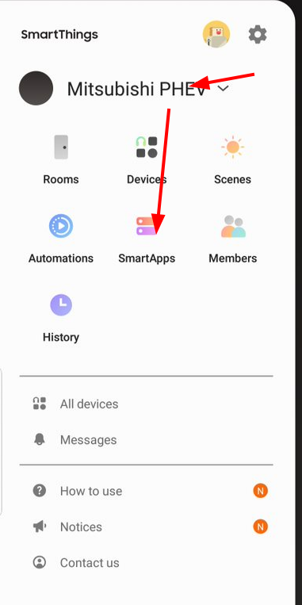
3. add SmartApp 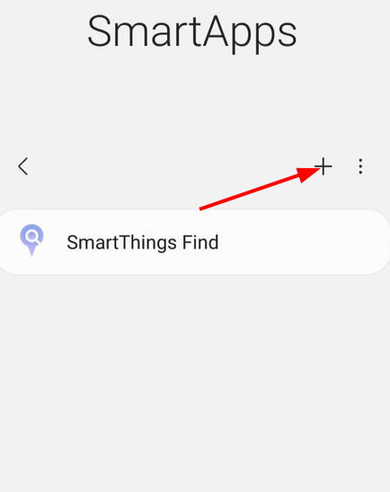
4. add "remote-ctrl-gsm" 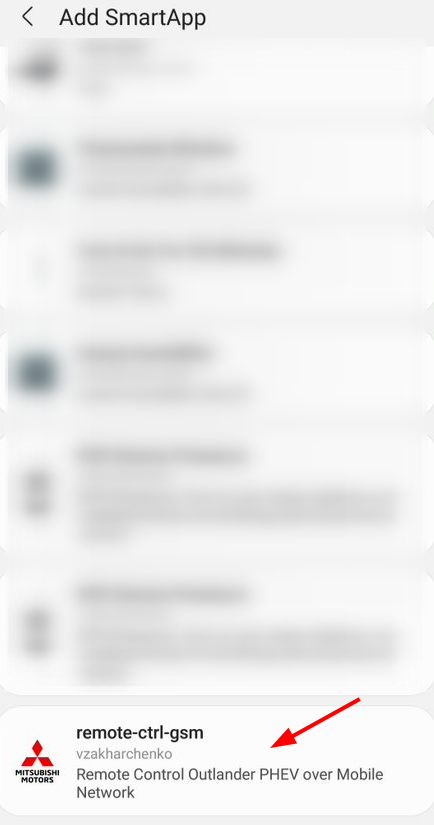
5. set IP and port of server and click save 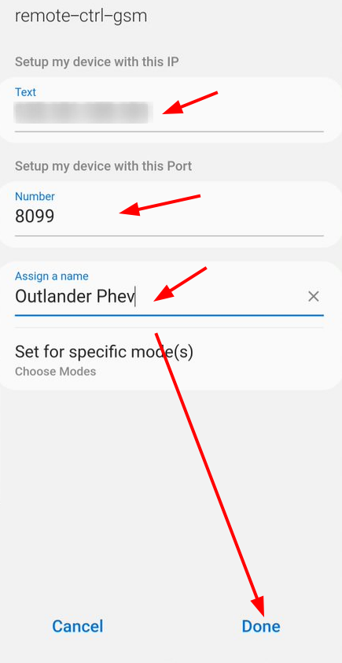

### Get "Smartthings Application Id" and "Smartthings Application Secret"
1. open [https://graph.api.smartthings.com/](https://graph.api.smartthings.com/)
2. select smartapps in your location 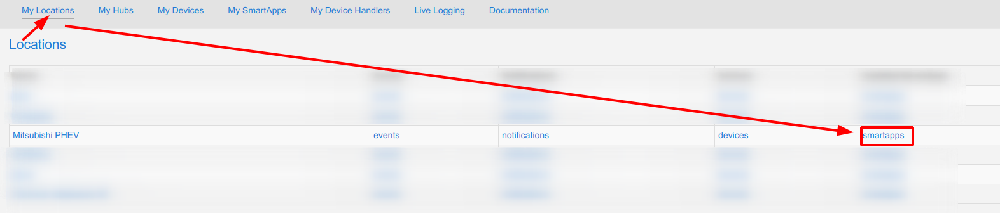
3. select your smartapp 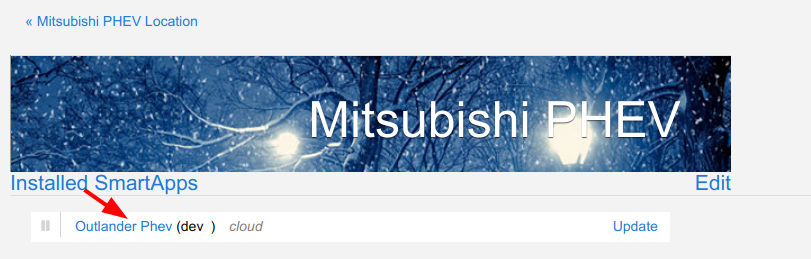
4. get "Smartthings Application Id" and "Smartthings Application Secret" from the page 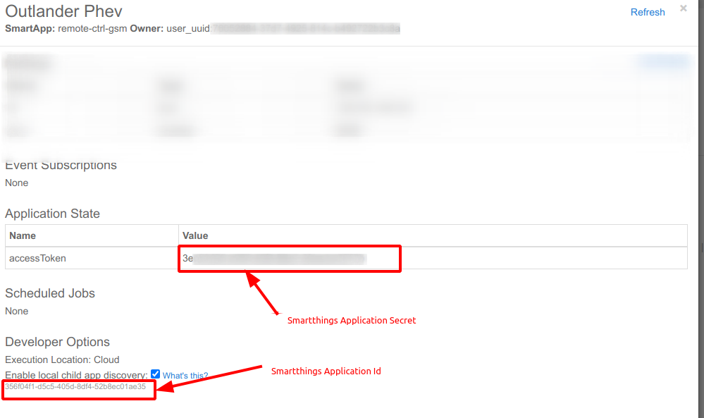

### Configure Server

1. open server ```http://<IP>:8080```
2. default login/password: admin/admin
3. configure "Smartthings Application Id", "Smartthings Application Secret" and mac address 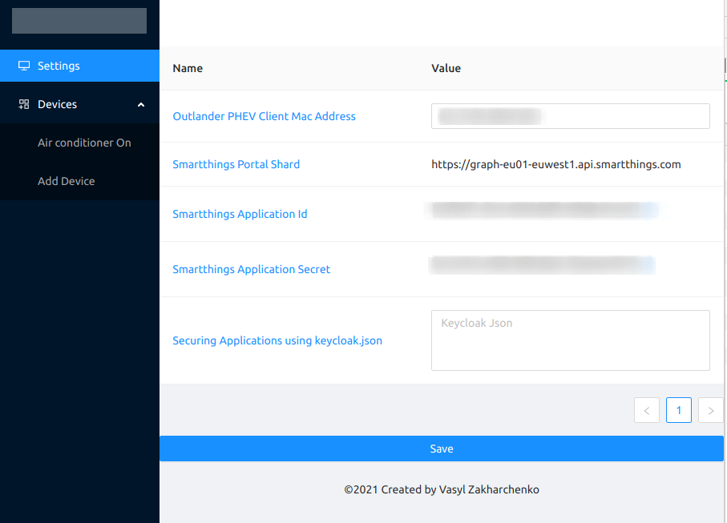
4. click save

### Add a new Smartthings device
1. select devices->add Device 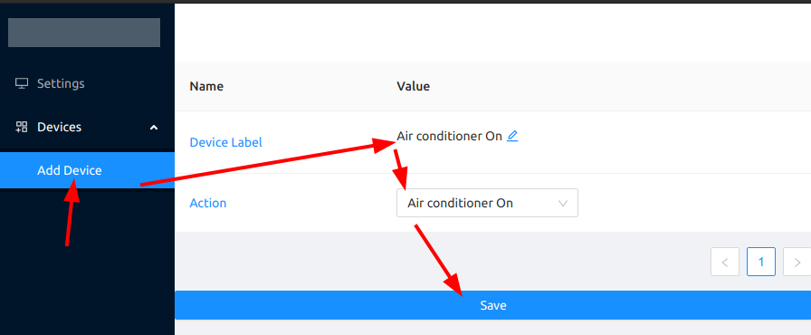
2. Device will be appear om Smartthings App

## Local Network Installation(under NAT)
- install [Smartthings Hub)[https://www.samsung.com/us/smart-home/smartthings/hubs/] on location.
- during installation smartapp select hub. 

# Authentication
## Local authentication (default)
default login/password: ```admin/admin```
### change password for user
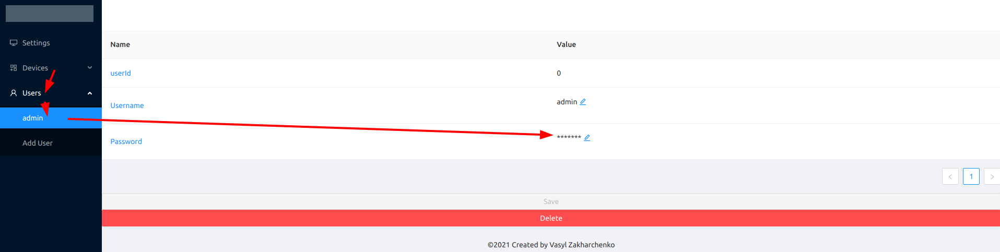

### add a new User
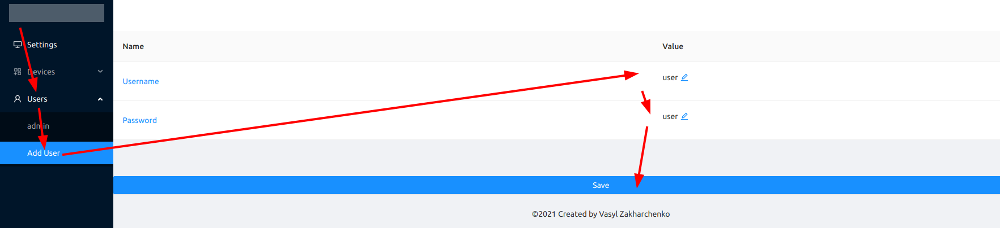

## Keycloak authentication

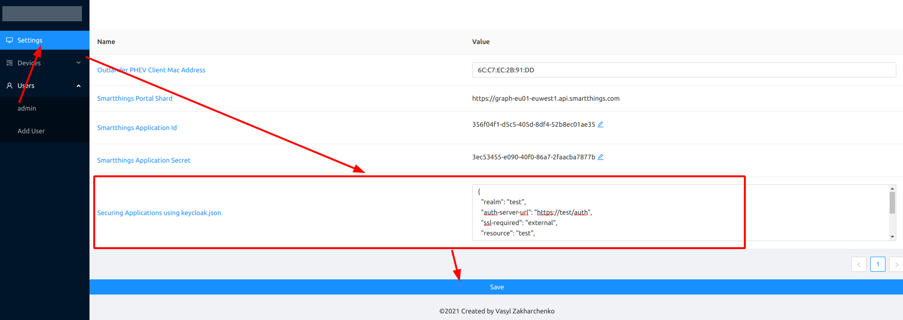

restart Application

## Thermostat operation state
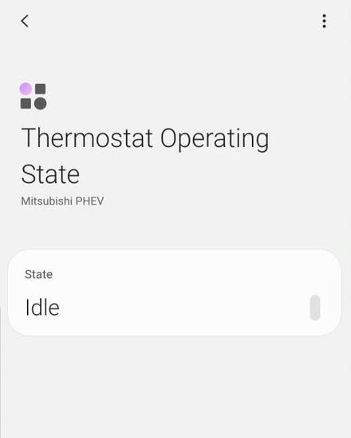
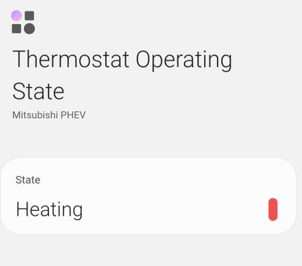
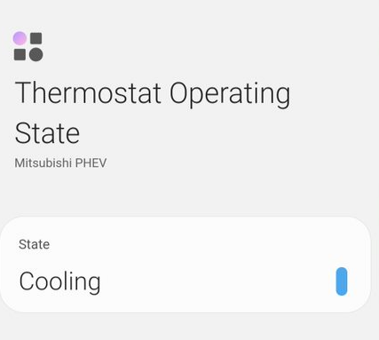


## Push Notification


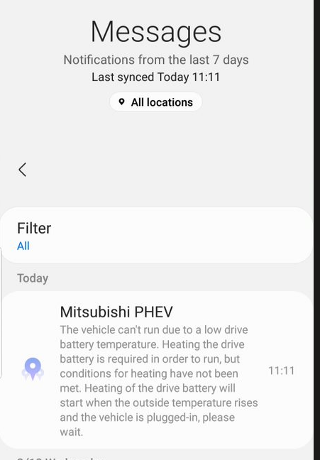


